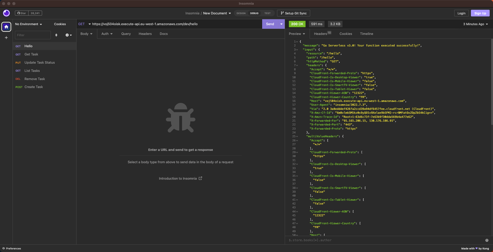

# AWS API Gateway

The goal of this workshop is to discover Serverless infrastructure using AWS API Gateway.

You’ll have to deploy an API Gateway and leverage of Cognito for the users management and DynamoDB for the storage. The final result will be a simple To-Do List service that will allow you to create, get, update and delete tasks.

You’ll use the Serverless framework to automatically deploy your resources.

## Prerequisites

- Node v14.17.0 installed ([nvm](https://github.com/nvm-sh/nvm) is recommended to switch Node version) and basic NodeJS knowledge
- [Serverless framework](https://www.serverless.com/framework/docs/getting-started) installed
- [AWS CLI v2](https://docs.aws.amazon.com/cli/latest/userguide/getting-started-install.html) installed
- [Postman](https://www.postman.com/) or [Insomnia](https://insomnia.rest/) installed

## Task 1: Discovery

First of all, you’ll have to clone the workshop repository:

```bash
$ git clone git@github.com:jgchoppe/workshop-apigw-uncomplete.git
```

As you can see in it’s name, this repository is uncompleted. The following steps will help you complete it step by step.

### Serverless Discovery

Before diving into the To-Do list functionalities I want you to focus on the `serverless.yml` file, you must update the `service` value at the top of the file by adding your name at the end of the value, for example: `service: apigw-workshop-jg`. It’s truly important for this workshop to avoid name conflicts between you and the other students.

Now you can look at its first function:

```yaml
functions:
  hello:
    handler: handler.hello
    events:
      - http:
          path: /hello
          method: get
          cors: true
```

For now we only have 1 function, but keep in mind that the functions represent each route you want to create inside your API.

Your first function is called hello, and has a handler function called `hello` that you can find in the `handler.js` file the handler is always looking as it:

```yaml
handler: PATH/TO/YOUR/FILE/FILENAME.FUNCTION_NAME
```

We’re creating an API Gateway that’s why you have an http event which is always containing:

- the `path` of the route
- the `method` of the route
- `cors` enabled or not

Basically, this function will create:

- An AWS Lambda function
- API Gateway resource, integration and method for the route specified

### Hello Function Discovery

You should now take a look at the `handler.js` file where the `hello` function lives:

```jsx
'use strict';

module.exports.hello = async (event) => {
  return {
    statusCode: 200,
    body: JSON.stringify(
      {
        message: 'Go Serverless v3.0! Your function executed successfully!',
        input: event,
      },
      null,
      2
    ),
  };
};
```

The function is receiving an `event` as the input. This input contains all the data you need such as the body, the query and query path parameters but also customer information.

> 💡 At this point you don’t need to understand what’s in the `event` object. However, it’s still good to know what’s in it for the next steps. You can find the documentation [here](https://docs.aws.amazon.com/lambda/latest/dg/services-apigateway.html#apigateway-example-event).
>

Our `hello` function is returning the response containing:

- The HTTP status code of your response called `statusCode`
- The `body` of your response which can contain what ever object you want, here we only have a string called `message`

If you have any other questions about the configuration, let me know!

## Task 2: Your first deployment

### AWS Configuration

Before diving into your first deployment, let’s connect to the AWS account!

You received an email containing your AWS credentials, so you can follow this [link](https://www.notion.so/AWS-API-Gateway-83ee62376c6d47b999ae549d0d28d13f) and enter your credentials to access the AWS account.

> ⚠️ Make sure to select `IAM user` if needed on the first page before clicking on the `Next` button.
>

Once you’re connected, make sure you are in the `eu-west-1` region (Ireland).

We’re almost ready! Now, we need to configure the AWS CLI, so open a terminal window and enter the following command:

```bash
$ aws configure
```

You’ll be asked to enter the AWS Access Key ID and the AWS Secret Access Key. You received both with your credentials.

You can now try to run the following command to verify you have access to the AWS account:

```bash
$ aws s3 ls
```

Now we’re ready!

### Let’s deploy the infrastructure

Open a terminal window inside the repository and install NodeJS dependencies:

```bash
$ npm install
```

Then deploy the infrastructure:

```bash
$ npx serverless deploy
```

And voilà! It’s that easy.

You can now take a look at the output and copy the `GET` endpoint that has been generated for us:

```bash
endpoint: GET - https://APIGW_ID.execute-api.eu-west-1.amazonaws.com/dev/hello
```

You can query this endpoint using Postman or Insomnia, I’m using Insomnia:



You can now go the AWS Console, and look at the different services, if you’ve done the deployment correctly your resources name should contain your name:

- API Gateway
- Lambda

We’ll take a look at the other resources that has been deployed together!

## Task 3: User management

We just talked about Cognito together. Since the Cognito resources are already configured, we won’t have to do it, however it’s same for you to create a new endpoint (so a new function), but this time it has to be protected and can only be reached by an authenticated user.

### Configure a protected endpoint

An `Authorizer` has already been created as well. In API Gateway an `Authorizer` is acting like a middleware that is going to run before your Lambda Function to verify the requester is authenticated. In this step, your goal is to use this `Authorizer` within a new function called `hello_authorized`.

The function is already created and located in `./src/services/hello/authorized_handler.js`.

> 💡 You’ll be able to find information about how to attach an `Authorizer` to a function [here](https://www.serverless.com/framework/docs/providers/aws/events/apigateway#http-endpoints-with-custom-authorizers).
>

### Retrieve user information

If you already took a look at the `authorized_handler.js` file, you know what we need to do now: implement the `ClaimsInfoDecoratorFunction`.

A decorator is a function that makes some action before calling the handler function and after receiving the answer. Here we’ll use this decorator to retrieve the userId, which is going to be really important for the next steps.

Let’s open `.src/common/decorators/ClaimsInfoDecorator.js`:

```jsx
async function ClaimsInfoDecorator(handler, event) {
  // TODO: Retrieve user id return error if no id has been found
  const userId = "fakeId"

  return handler(event, userId)
}

module.exports = {
  ClaimsInfoDecorator,
}
```

As you can see the userId is currently just a fake one. You have access to the event input (which we talked about earlier). Your goal is going to find the user ID and in case of none return an error.

> 💡 Look at the event input documentation
>

### Deployment and testing

You know how to deploy our API, right ? Just do it again to apply your changes and deploy the new API endpoint!

But how about testing ? You need to be authenticated to make the request, otherwise it won’t work.

You can go this [site](https://apigw-workshop.jgchoppe.fr) to authenticate yourself. Before signing up and signing in you’ll have to enter some information:

- Cognito information that you can find inside the AWS Cognito User Pool console:
    - The Cognito User Pool ID
    - Cognito User Pool Client ID
- Your API URL: `https://APIGW_ID.execute-api.eu-west-1.amazonaws.com/dev`

Once it’s done you should be able to create a new account then to copy the token.

You can now make an HTTP request to your new authorized endpoint, but don’t forget to put the token inside the header. I’ll let you find what the field’s header for your token!

## Task 4: Implement the To-Do List service

Finally! We’ll do something interesting (I hope you’re not thinking that)…

You’ll have more freedom on this task. Your goal is to implement the To-Do List service. This service will use DynamoDB to store the data. DynamoDB is a AWS NoSQL Database but you don’t have to worry about that because I already created the functions to interact with that database.

However, your app still needs permissions to be able to communicate with DynamoDB, you’ll then have to create a IAM role **Allowing** your Lambda functions to use **dynamodb:*** actions but only on our DynamoDB Table that has been created.

> 💡 Take a look at [this documentation](https://www.serverless.com/framework/docs/providers/aws/guide/iam) to proceed.
>

Now that your app has enough permissions you should implement the different functions.

### Create Task

**Method**: `POST`

**Path**: `/tasks`

You can find this function here: `src/services/toDoList/createTask/createTask.js`.

**Example JSON Body**:

```json
{
	"name": "Example Name",
	"description": "Example Description",
	"dueDate": "2023-10-10"
}
```

**Example JSON Response**:

```json
{
	"task": {
      "id": "fakeTaskId",
      "userId": "fakeUserId",
      "status": "TODO",
      "name": "Example Name",
      "description": "Example Description",
      "dueDate": "2023-10-10",
      "type": "TASK"
    }
}
```

> 💡 You should take a look at the `TodoListRepository` class to create a task
>

### Get Task

**Method**: `GET`

**Path**: `/tasks/{id}`

You can find this function here: `src/services/toDoList/getTask/getTask.js`.

**Example JSON Response**:

```json
{
	"task": {
      "id": "fakeTaskId",
      "userId": "fakeUserId",
      "status": "TODO",
      "name": "Example Name",
      "description": "Example Description",
      "dueDate": "2023-10-10",
      "type": "TASK"
    }
}
```

> 💡 You should take a look at the event input documentation to retrieve the Task ID that has been sent.
>

### List Tasks

**Method**: `GET`

**Path**: `/tasks`

You can find this function here: `src/services/toDoList/listTasks/listTasks.js`.

The function has already been implemented for you, but you still have to create it inside `serverless.yml`.

### Remove Task

**Method**: `DELETE`

**Path**: `/tasks/{id}`

You can find this function here: `src/services/toDoList/removeTask/removeTask.js`.

> 💡 You should take a look at the event input documentation to retrieve the Task ID that has been sent.
>

### Update Task

**Method**: `PUT`

**Path**: `/tasks/{id}`

You can find this function here: `src/services/toDoList/updateTask/updateTask.js`.

> 💡 You should take a look at the event input documentation to retrieve the Task ID that has been sent.
>

If you think everything’s working you can test using [this site](http://apigw-workshop.jgchoppe.fr/).

## Go Further

If you still have time you could now implement `Sub-Tasks` ! If you want to do this you will need to add some functions to the `TodoListRepository`. However this guide won't help you for this part, good luck!

## Feedbacks

You finally did it, I told you it was easy. You’re now ready to push it at the next level and use it for your new projects !

If you enjoyed this workshop, can you please fill [this quick form](https://epiform.typeform.com/to/hK0bo7Q6) to give me some feedbacks and help me improve for the next one. Thanks!

You can find the complete repository [here](https://github.com/jgchoppe/workshop-apigw).
